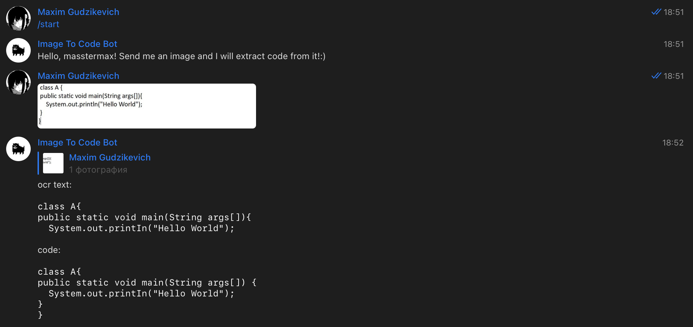
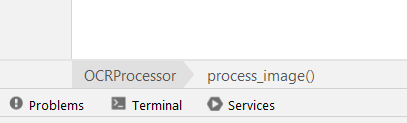
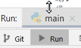
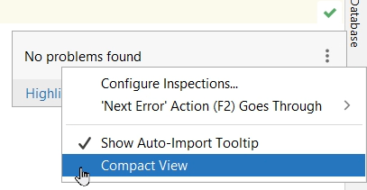

[](https://codecov.io/gh/gudarikon/image-to-code)

# image-to-code

This is a repository with a source code of image to code generation. The repository contains code image dataset generator, OCR model, NLP model for recognizing code from text and telegram bot script.



**Authors**: [Alexey Kononov](https://github.com/llesha), [Azamatkhan Arifkhanov](https://github.com/Sm1Ling), and [Maxim Gudzikevich](https://github.com/MassterMax)
<br/><br/>


# Table of Contents

1. [Code to image dataset generator](#Code-to-image-dataset-generator)
2. [Image to text generation](#Image-to-text-generation)
3. [Text to code generation](#Text-to-code-generation)
4. [Inference](#Inference)
4. [License](#License)
<br/><br/>


# Code to image dataset generator

A dataset generator is separate tool from the whole pipeline. It was created specifically for this
project to generate dataset which contains code and its screenshots.

Generated datasets:

1. [Code blocks screenshots](https://www.kaggle.com/datasets/alexeykononov5041/java-code-screenshots)
2. [Functions screenshots](https://www.kaggle.com/datasets/alexeykononov5041/java-code-search-net-function-screenshots)

## Requirements

1. An IntelliJ IDE for any language:
    * IntelliJ IDEA
    * PyCharm
    * GoLand
    * PhpStorm
    * etc.
2. A 1920x1080 resolution screen

## How to use

Image generator works in two modes: code blocks screenshots and functions screenshots.

### Preparation

1. Remove breadcrumbs:
   Right lick on the bottom panel showing current classes, methods, etc. (In this screenshot it
   shows `OCRProcessor>process_image()`)

   

   Choose `Breadcrumbs` in the opened menu, pick `Don't Show`

   *Later breadcrumbs are restored in
   the* [Editor | General | Breadcrumbs](https://www.jetbrains.com/help/pycharm/settings-editor-breadcrumbs.html)
   *menu*

2. Open terminal window - click `Run` in the bottom panel, then move opened window to the bottom:

   

3. Remove gutter icons: right click in gutter | Configure Gutter Icons... | Show gutter icons
4. Open filetree and move it to the maximal left position.
5. Set language to English.
6. Compact View of inspections (top right corner):

   

7. Remove ligatures
   in [Editor | Font | Enable ligatures](https://www.jetbrains.com/webstorm/guide/tips/font-ligatures/)

### Using code blocks screenshots

1. Open IntelliJ project
2. Set `repo_path` in config.json to project path
3. Run `code_to_image/main_code_blocks.py`

### Using functions screenshots

1. Create empty IntelliJ project
2. Run `dataset_parser.py`, with `repo_path` in config.json set to empty
   project, `code_search_functions_path` to jsonl dataset
   from [code search net](https://huggingface.co/datasets/code_search_net)
3. Run `code_to_image/main_functions.py`

### Config

Config is stored in config.json. Here you can specify data folders and change path to repository
that is opened in intellij IDE. **If you manually moved Run panel or filetree panel, change
visible_lines and visible_symbols to -1 and move it as you did in preparation steps.**

### Stopping screenshots

If you want to stop the program, move your mouse during screenshots. The program will exit after
current file is finished. All traversed files are saved.
<br/><br/>


# Image to text generation

This part contains info about OCR processors used to extract text from the images.
Available solutions could be found in `src/image_to_text/processors/`

New solutions could be easily added using `src/image_to_text/processors/ocr_processor.py` base class. Don't forget to add custom processor to `src/image_to_text/processors.__init__` for convenient access via strings in `src/image_to_text/img_to_text.py `

## [Tesseract](https://github.com/tesseract-ocr/tesseract)


First of all one should install Tesseract on the machine.

> Install `Google Tesseract OCR <https://github.com/tesseract-ocr/tesseract>`_
  (additional info how to install the engine on Linux, Mac OSX and Windows).
  You must be able to invoke the tesseract command as *tesseract*. If this
  isn't the case, for example because tesseract isn't in your PATH, you will
  have to change the "tesseract_cmd" variable ``pytesseract.pytesseract.tesseract_cmd``.
  Under Debian/Ubuntu you can use the package **tesseract-ocr**.
  For Mac OS users. please install homebrew package **tesseract**.

Once Tesseract is installed the path to tesseract.exe file should be added to the local `.env` file. See `.env.example` template.
  
## [PaddleOCR](https://github.com/PaddlePaddle/PaddleOCR)

More advanced OCR for image processing. Supports text boxes which allow to add line spacing to the parsed text.

## Config

All the processors classes contain `**kwargs` essential for the proper operation. Thus, `.json` formatted config templates are provided in `resources/configs/` 
<br/><br/>


# Text to code generation

*here I will write something about text to code generation*

Update: we settled on [T5Code](https://github.com/salesforce/CodeT5)
<br/><br/>


# Inference

## Local usage

For launching the whole pipeline you can run the following:

```shell
~$ /cd image-to-code
/image-to-code$ PYTHONPATH=./ python3 \
                src/telegram_handler/pipeline_manager.py \
                /path/to/image.png
```

## Usage with telegram bot

We are deploying the bot via GitHub action `.github/workflows/deploy_action.yml` and `run.sh` files, you can reuse them in your project.

[Image To Code Bot](https://t.me/image_to_code_bot) is ready to receive images to return OCR text and parsed code from them.

Currently the bot supports two operations: 
  - `/start` - the bot will greet you
  - `<sent image>` - the bot will answer with two blocks - OCR text result and code result (after applied T5Code tuned refine model)
 <br/><br/>


 # License

The default license for this repository is Apache 2.0.
